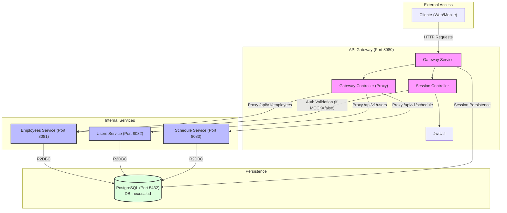

# Diagrama UML de Módulos Backend - Nexo Salud

Este diagrama representa la arquitectura de microservicios del backend, mostrando las interacciones entre el Gateway, los servicios internos y la base de datos.

## Detalles de Arquitectura

- **Gateway (8080)**: Punto de entrada único. Maneja la autenticación JWT y redirige las peticiones a los servicios correspondientes.
- **Employees Service (8081)**: Gestiona la información de los empleados y la autenticación real (si no está en modo mock).
- **Users Service (8082)**: Gestiona los usuarios finales del sistema.
- **Schedule Service (8083)**: Gestiona las agendas y citas médicas.
- **Base de Datos**: PostgreSQL compartida. Cada servicio utiliza su propio esquema o tablas dentro de la base de datos `nexosalud`.
- **Comunicación**: Basada en Spring WebFlux (Reactiva) utilizando `WebClient` para peticiones entre servicios y `R2DBC` para acceso a datos.
