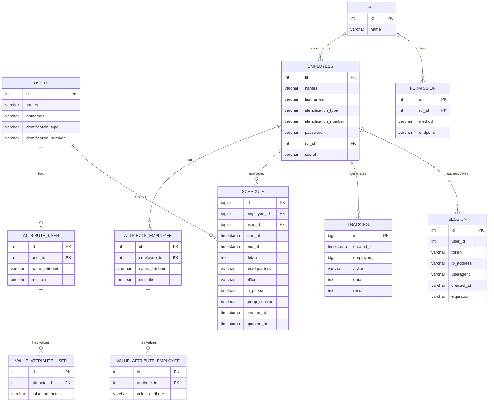

# Diagrama Entidad-Relación (MER) - Nexo Salud

Este diagrama representa la estructura de la base de datos `nexosalud` compartida por los microservicios.

## Detalles del Modelo

### Módulo de Usuarios (Users)
- **USERS**: Almacena la información básica de los pacientes/usuarios.
- **ATTRIBUTE_USER / VALUE_ATTRIBUTE_USER**: Sistema flexible para agregar atributos dinámicos a los usuarios.

### Módulo de Empleados (Employees)
- **EMPLOYEES**: Personal médico y administrativo.
- **ROL / PERMISSION**: Sistema RBAC (Role-Based Access Control) para gestionar permisos sobre endpoints.
- **ATTRIBUTE_EMPLOYEE / VALUE_ATTRIBUTE_EMPLOYEE**: Atributos dinámicos para empleados.

### Módulo Gateway
- **SESSION**: Gestión de sesiones activas y tokens JWT.
- **TRACKING**: Auditoría de acciones realizadas por los empleados.

### Módulo de Agenda (Schedule)
- **SCHEDULE**: Citas médicas que vinculan a un empleado (médico) con un usuario (paciente).
